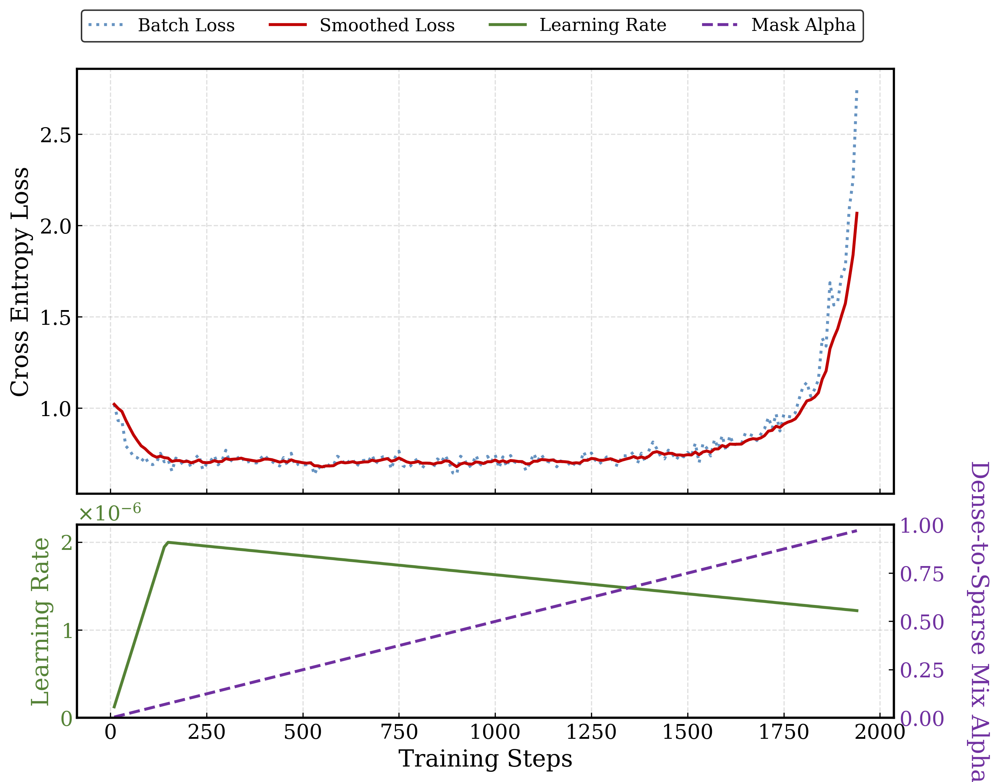
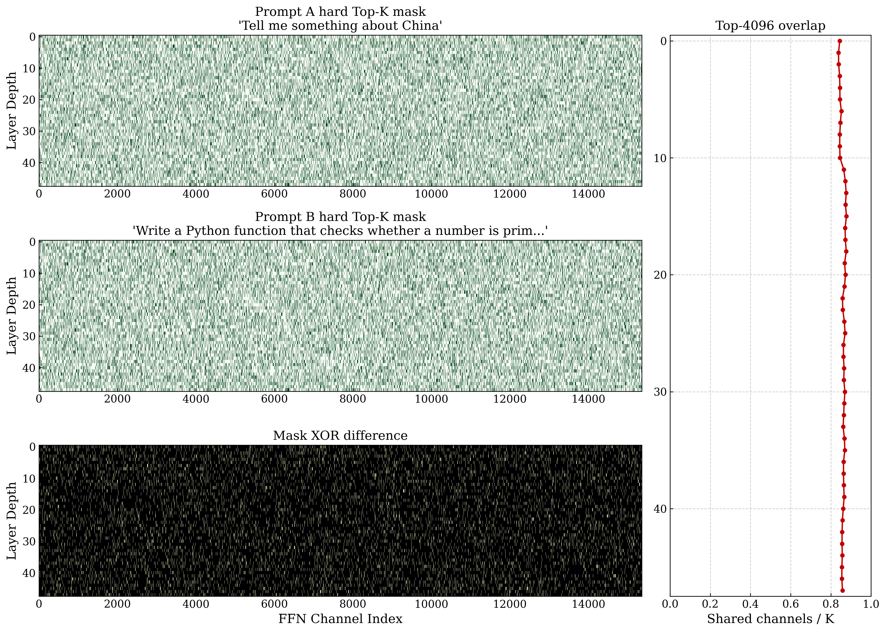

# IFPruning-SFT

> An unofficial, research-oriented implementation of the supervised fine-tuning stage from **Instruction-Following Pruning for Large Language Models**.

[GitHub Repository](https://github.com/yangzy723/IFPruning-SFT) · [Paper](https://arxiv.org/abs/2501.02086) · [Local Paper](docs/Instruction-Following%20Pruning%20for%20Large%20Language%20Models.pdf) · [Gemma 4 12B](https://huggingface.co/google/gemma-4-12B-it) · [Qwen3.5 0.8B](https://huggingface.co/Qwen/Qwen3.5-0.8B)

## Overview

IFPruning learns an input-dependent structured pruning policy for large language models. A lightweight predictor reads the user instruction and produces channel-level importance scores for every feed-forward network (FFN) layer. These scores are converted into fixed-budget masks and reused throughout generation.

This repository provides a text-only implementation built around:

- [google/gemma-4-12B-it](https://huggingface.co/google/gemma-4-12B-it) as the masked language model;
- [Qwen/Qwen3.5-0.8B](https://huggingface.co/Qwen/Qwen3.5-0.8B) as the prompt-conditioned sparsity predictor;
- [yahma/alpaca-cleaned](https://huggingface.co/datasets/yahma/alpaca-cleaned) and [teknium/OpenHermes-2.5](https://huggingface.co/datasets/teknium/OpenHermes-2.5) as the default SFT data sources;
- DeepSpeed ZeRO-3 for distributed training and checkpoint recovery.

> [!IMPORTANT]
> The paper trains IFPruning in two stages: continued pre-training followed by SFT. This repository currently implements **SFT only**. It also uses substantially less data and compute than the paper, so its results must not be presented as a reproduction of the paper's reported benchmark scores.

## Method

### Prompt-conditioned routing

For a user instruction, the predictor extracts the final-token representation and maps it to layer-wise FFN scores:

$$
S = g_{\phi}(x), \qquad S \in \mathbb{R}^{L \times D_{\mathrm{ffn}}},
$$

where $L$ is the number of transformer layers and $D_{\mathrm{ffn}}$ is the original FFN intermediate dimension.

The current prediction head is:

```text
prompt → Qwen3.5-0.8B → LayerNorm → Linear(d, 128)
       → LeakyReLU → Linear(128, L × Dffn) → routing scores
```

The predictor backbone, prediction head and masked LLM are optimized jointly.

### Differentiable fixed-budget masking

During training, the implementation follows the paper's soft masking form:

$$
\lambda = \mathrm{SoftTopK}(S, k), \qquad
m = \lambda \odot \mathrm{Top}(\lambda, k).
$$

The threshold used by `SoftTopK` is solved by binary search while preserving its implicit gradient. During validation and inference, the mask becomes an exact binary Top-K mask with exactly $k$ active FFN channels per layer.

### Dynamic FFN injection

For a gated FFN,

$$
H = \mathrm{Act}(XW_{\mathrm{gate}}) \odot XW_{\mathrm{up}},
$$

the selected mask is applied before the down projection:

$$
Y =
\left[
(1-\alpha)H
+
\alpha(H \odot m)
\right]
W_{\mathrm{down}},
$$

where $\alpha$ gradually moves training from the dense path to the sparse
path. Validation always evaluates the fully sparse, hard-mask configuration
used at deployment.

## Repository layout

```text
IFPruning-SFT/
├── train.py                 # Training entry point, Trainer and checkpoint logic
├── inference.py             # Single-prompt and interactive inference
├── ifpruning_core.py        # Predictor, SoftTopK and dynamic FFN modules
├── ifpruning_data.py        # Dataset normalization and SFT sequence builder
├── inspect_model.py         # Base-model structure inspection
├── visualize_loss.py        # Loss, learning-rate and mask-alpha plots
├── visualize_routing.py     # Hard Top-K routing comparison
├── docs/                    # Papers and external reference material
│   ├── Instruction-Following Pruning for Large Language Models.pdf
│   └── apple-foundation-models.png
├── figs/                    # Project figures and visualizations
├── tests/
│   ├── unit/                # Fast, hardware-independent unit tests
│   └── integration/         # Multi-GPU DeepSpeed checkpoint tests
└── requirements.txt
```

## Documentation and references

- [Instruction-Following Pruning for Large Language Models (local PDF)](docs/Instruction-Following%20Pruning%20for%20Large%20Language%20Models.pdf)
- [Apple Foundation Models reference screenshot](docs/apple-foundation-models.png)

## Installation

### Conda environment

The current workspace uses the `Vitamin-E` environment:

```bash
conda activate Vitamin-E
cd ~/IFPruning-SFT
pip install -r requirements.txt
```

For a clean installation:

```bash
conda create -n Vitamin-E python=3.12 -y
conda activate Vitamin-E

# Install a PyTorch build compatible with the host CUDA driver first.
pip install torch
pip install -r requirements.txt
```

PyTorch and CUDA versions must match the target machine. The default training configuration uses BF16 and is intended for recent data-center GPUs; FP16/FP32 can be selected where appropriate.

## Model and dataset preparation

### Official resources

| Role | Hugging Face repository | Default local path |
| --- | --- | --- |
| Base LLM | [google/gemma-4-12B-it](https://huggingface.co/google/gemma-4-12B-it) | `./gemma-4-12B` |
| Sparsity predictor | [Qwen/Qwen3.5-0.8B](https://huggingface.co/Qwen/Qwen3.5-0.8B) | `./Qwen3.5-0.8B` |
| Instruction data | [yahma/alpaca-cleaned](https://huggingface.co/datasets/yahma/alpaca-cleaned) | `./alpaca-cleaned` |
| Conversation data | [teknium/OpenHermes-2.5](https://huggingface.co/datasets/teknium/OpenHermes-2.5) | `./OpenHermes-2.5` |

Install the official Hugging Face CLI and authenticate if required:

```bash
pip install -U "huggingface_hub[cli]"
hf auth login
```

Download the models:

```bash
hf download google/gemma-4-12B-it \
  --local-dir ./gemma-4-12B

HF_ENDPOINT=https://hf-mirror.com hf download Qwen/Qwen3.5-0.8B \
  --local-dir ./Qwen3.5-0.8B
```

Download the datasets:

```bash
hf download yahma/alpaca-cleaned \
  --repo-type dataset \
  --local-dir ./alpaca-cleaned

hf download teknium/OpenHermes-2.5 \
  --repo-type dataset \
  --local-dir ./OpenHermes-2.5
```

The default training paths expect:

```text
./alpaca-cleaned/alpaca_data_cleaned.json
./OpenHermes-2.5/openhermes2_5.json
```

By default, all Alpaca examples and a seeded 100,000-example OpenHermes sample are used. Alternative local paths and sample counts can be provided through `train.py` arguments.

## Training

### Start a new run

```bash
OMP_NUM_THREADS=1 \
TRANSFORMERS_NO_ADVISORY_WARNINGS=1 \
PYTORCH_CUDA_ALLOC_CONF=expandable_segments:True \
torchrun --nproc_per_node=2 train.py \
  --output_dir ./gemma-12B-ifpruning-output \
  --zero_stage 3 \
  --per_device_train_batch_size 4 \
  --gradient_accumulation_steps 4
```

With two GPUs, this launch configuration produces a global batch size of 32:

```text
4 samples/GPU × 2 GPUs × 4 gradient-accumulation steps = 32
```

ZeRO-3 partitions model parameters, gradients and optimizer states. Optimizer subgroups are capped at 500 million parameters to avoid oversized temporary buffers.

The training entry point refuses to start a fresh run in a non-empty output directory. This prevents accidental checkpoint mixing. Use `--overwrite_output_dir` only when intentional.

### Resume a run

Resume from the newest checkpoint:

```bash
torchrun --nproc_per_node=2 train.py \
  --output_dir ./gemma-12B-ifpruning-output \
  --zero_stage 3 \
  --per_device_train_batch_size 4 \
  --gradient_accumulation_steps 4 \
  --resume auto
```

Or provide an explicit checkpoint:

```bash
torchrun --nproc_per_node=2 train.py \
  --output_dir ./gemma-12B-ifpruning-output \
  --zero_stage 3 \
  --per_device_train_batch_size 4 \
  --gradient_accumulation_steps 4 \
  --resume ./gemma-12B-ifpruning-output/checkpoint-500
```

Resume validates the current checkpoint manifest strictly: layer count, FFN dimensions, predictor architecture, SoftTopK settings, ZeRO stage and chat-template configuration must match the checkpoint manifest.

### Important defaults

| Argument | Default | Description |
| --- | ---: | --- |
| `--target_intermediate_dim` | `4096` | Active FFN channels per layer |
| `--max_seq_length` | `2048` | Maximum LLM training length |
| `--max_response_length` | `512` | Maximum supervised response length |
| `--max_predictor_length` | `1024` | Maximum predictor input length |
| `--per_device_train_batch_size` | `4` | Training micro-batch size per GPU |
| `--per_device_eval_batch_size` | `2` | Validation micro-batch size per GPU |
| `--gradient_accumulation_steps` | `4` | Gradient accumulation steps |
| `--warmup_steps` | `0.03` | Optimizer warmup ratio under the Transformers 5 API |
| `--zero_stage` | `3` | DeepSpeed ZeRO stage; ZeRO-3 shards parameters, gradients and optimizer states |
| `--base_lr` | `2e-6` | Masked LLM learning rate |
| `--predictor_lr` | `1e-5` | Predictor learning rate |
| `--mask_warmup_steps` | `2000` | Dense-to-sparse transition |
| `--validation_samples` | `512` | Fixed validation examples |
| `--eval_steps` | `500` | Hard-mask evaluation interval |
| `--save_steps` | `500` | Checkpoint interval |
| `--save_total_limit` | `1` | Keep only the latest training checkpoint |

Run `python train.py --help` for the complete configuration. The documented training path uses DeepSpeed ZeRO-3 for full fine-tuning of the 12B base model.

## Inference

### Single prompt

```bash
python inference.py \
  --checkpoint ./gemma-12B-ifpruning-output \
  --prompt "Write a Python function that checks whether a number is prime."
```

### Interactive mode

Omit `--prompt`:

```bash
python inference.py \
  --checkpoint ./gemma-12B-ifpruning-output
```

The checkpoint must contain the current manifest, base tokenizer, predictor tokenizer and the predictor payload produced by `train.py`. Use `--predictor-model` only when the path recorded in the manifest is unavailable on the inference machine.

Useful options:

- `--do-sample`: enable sampling instead of greedy decoding
- `--temperature 0.7 --top-p 0.9`: configure sampling
- `--dtype auto|bfloat16|float16|float32`: select inference precision
- `--dense`: disable masks for a dense-path comparison
- `--score-dir ./routing_scores`: choose where routing scores are saved

Generation stops on either the tokenizer EOS token or Gemma's `<turn|>` token. Interactive inference also reports Top-K overlap between adjacent prompts and warns when all layer masks are identical.

## Checkpoints

A final export contains:

```text
model*.safetensors             # Masked LLM weights
predictor.safetensors          # Full predictor
ifpruning_config.json          # Architecture and routing manifest
predictor_tokenizer/           # Predictor tokenizer
trainer_state.json             # Trainer state and metric history
```

Training logs persist `mask_alpha`, `routing_input_std` and `routing_head_active_fraction`. Non-finite loss, repeated near-zero loss or persistent input-independent routing raises an error and prevents the failed run from being exported as a successful final model.

## Validation and tests

Run the lightweight regression suite:

```bash
python -m unittest discover -s tests/unit -t . -v
python -m py_compile \
  train.py inference.py ifpruning_core.py ifpruning_data.py \
  inspect_model.py visualize_loss.py visualize_routing.py
```

Run the two-phase DeepSpeed checkpoint test:

```bash
TEST_PHASE=1 torchrun --nproc_per_node=2 tests/integration/test_checkpoint.py
TEST_PHASE=2 torchrun --nproc_per_node=2 tests/integration/test_checkpoint.py
```

Before a long run, evaluate a fixed set of instruction-following, mathematics and coding prompts with:

1. the original dense base model;
2. the current checkpoint's dense path (`inference.py --dense`);
3. the current checkpoint's hard-sparse path.

Training loss alone is not sufficient evidence that prompt-conditioned routing is working.

## Visualization

Plot training loss, learning rate and mask alpha:

```bash
python visualize_loss.py \
  --log ./gemma-12B-ifpruning-output/logs/rank_0.log \
  --output ./figs/loss_curve.png
```



Compare the hard Top-K masks for two saved prompts:

```bash
python visualize_routing.py \
  routing_scores/score_01.pt \
  routing_scores/score_02.pt \
  --target-dim 4096
```



## Parameter-count and performance notes

The local Gemma 4 12B configuration has 48 transformer layers and an FFN intermediate dimension of 15,360. Selecting 4,096 channels retains 26.67% of each FFN. After accounting for attention, embeddings and other non-FFN parameters, the theoretical active base-model size is approximately **5.73B parameters**.

The current PyTorch implementation computes the full `gate_proj` and `up_proj` matrix multiplications before masking their activations. It is suitable for algorithm development and quality evaluation, but it does **not** provide real inference acceleration. Production speedups require gathering and caching physically reduced FFN weight matrices for the selected mask.

## Limitations and roadmap

- [ ] Implement the continued pre-training stage from the paper
- [ ] Expand and clean the instruction data mixture
- [ ] Add IFEval, HumanEval/MBPP, GSM8K/MATH and other fixed benchmarks
- [ ] Select best checkpoints using task-level evaluation
- [ ] Implement physical FFN weight gathering and caching
- [ ] Publish a complete training and evaluation report

## Citation

If you use this repository, please cite the original IFPruning paper:

```bibtex
@article{hou2025instructionfollowing,
  title   = {Instruction-Following Pruning for Large Language Models},
  author  = {Hou, Bairu and Chen, Qibin and Wang, Jianyu and Yin, Guoli and
             Wang, Chong and Du, Nan and Pang, Ruoming and Chang, Shiyu and Lei, Tao},
  journal = {arXiv preprint arXiv:2501.02086},
  year    = {2025}
}
```

## Acknowledgements

- [Instruction-Following Pruning for Large Language Models](https://arxiv.org/abs/2501.02086)
- [Google Gemma 4](https://huggingface.co/google/gemma-4-12B-it)
- [Qwen3.5](https://huggingface.co/Qwen/Qwen3.5-0.8B)
- [Alpaca Cleaned](https://huggingface.co/datasets/yahma/alpaca-cleaned)
- [OpenHermes 2.5](https://huggingface.co/datasets/teknium/OpenHermes-2.5)

This repository is an independent implementation and is not affiliated with the paper authors, Google or Qwen.